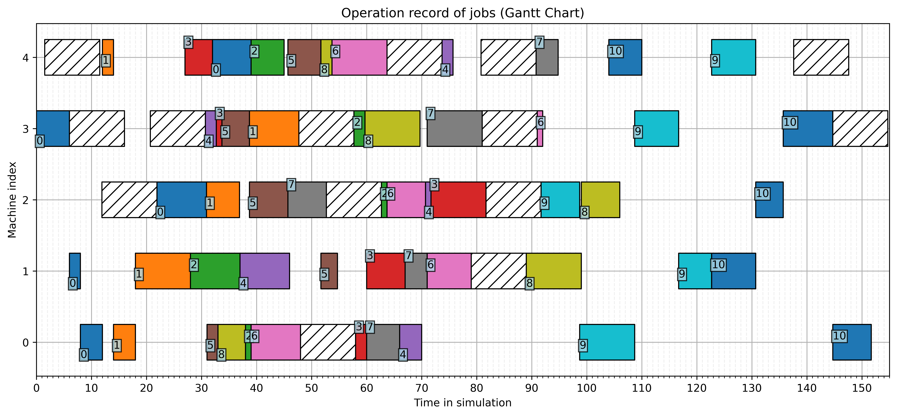

# DRLforDynamicScheduling

## Overview

This repository stores the source code for the research project entitled "Multi-agent Imitational, Chronological, and Asynchronous Reinforcement Learning Framework for Production Scheduling." Includes a discrete event simulator, centralized production scheudler (mathematical optimization and heuristics), and Deep Reinforcement Learning agent.

Recommended Python version >= 3.10, please note that Gurobi license is required to enable mathematical optimization-based scheduling (default), other wise fallback to ORTools, or heuristics.

## Project Structure

```
.
├── doc/                # Documentation and research proposal
├── math_modeling/      # Mathematical optimization models to solve production scheudling problem
├── src/                # Source code for the project
│   ├── DRL/            # Directory of Deep Reinforcement Learning Agent and parameters
│   ├── scheduler/      # Directory of centralized production scheduler
│   ├── simulator/      # Directory of discrete-event simulator 
│   └── utility.py      # Utility functions
├── .gitignore          # Specifies files and directories to be ignored by Git
├── main.py             # Main entry point to start simulation
├── README.md           # This file
└── requirements.txt    # Dependencies
```

## Guidelines

Run "main.py" for a simple demo!

```
python main.py
```

The default scheduler is "GurobiOptimizer", demo is a job shop scheduling problem with 5 machines (work stations), random jobs, and lasts for 100 units of time. The number of job is auto-generated, conditioned on the parameter of expected utilization rate ('-utl', default 60%). Jobs are created with random sequence and processing time. You can add extra randomness to the simulation by enabling non-deterministic processing time and/or machine breakdown. See "main.py" or "src/simulator/simulator" for all available parameters. Plot is disabled if runtime is greater than 200 to save our RAM.

No Gurobi license? Try ORTools:

```
python main.py -sqc 'ORTools'
```

An example of result:

